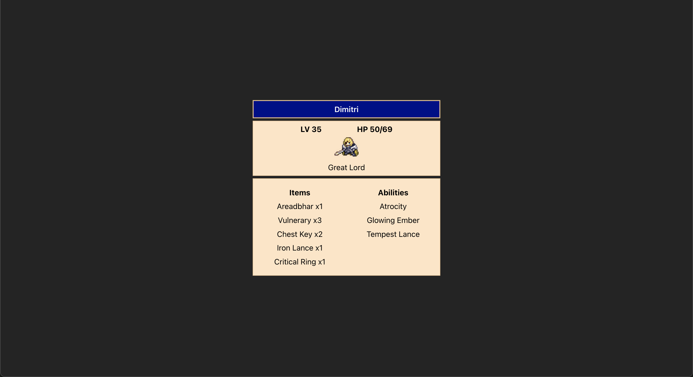

# 🌟 [Exercise 1] Character Card 💙
- Exercise directory: `/src/exercises/1-character-card/`
- Display exercise: http://localhost:5173/exercise1
- Sample answer: `/src/answers/1-character-card`
- Display sample answer: http://localhost:5173/answers/exercise1

## Writing markup
Plain markup is very similar to html, but wtih a couple more rules.
Similar to html, we can also style markup elements with css by importing the file at the top of the page, and using the `className` or `id` fields to label.

### html
```html
<h1>Kirby's questlog</h1>

<ul>
  <li>Invent new traffic lights
  <li>Rehearse a movie scene
  <li>Improve spectrum technology
</ul>
```
### jsx
- We must return a **singular** root div; it can be a regular div or an empty one like below called a fragment.
- All brackets must now be closed; you can see so in the `` and `<li>` elements.
```jsx
<>
  <h1>Kirby's questlog</h1>
  
  <ul>
    <li>Invent new traffic lights</li>
    <li>Rehearse a movie scene</li>
    <li>Improve spectrum technology</li>
  </ul>
</>
```
## Adding JavaScript
For many years, web developers kept content in HTML, design in CSS, and logic in JavaScript—often in separate files! Content was marked up inside HTML while the page’s logic lived separately in JavaScript.

However, with `.jsx` files, we can now embed JavaScript within the markup!

Starting with a simple example, we can include any javascript by just putting any logic inside curly braces `{ }`.

```jsx
const MyComponent = () => {
	// Variables
	const name = "Micolash";

	// Expressions
	const sum = 1 + 2;

	return (
		<>
			<p>Hello, {name}!</p>
			<p>1 + 2 is {sum} </p>
			<p>This also works! {1 + 2}</p>
		</>
	);
}

```

We can also directly return elements from functions

```jsx
const MyComponent = () => {
	// Function that doesn't take in anything, RETURNS a div
	const printMsg = () => {
		return <p>Ah, kos... or some say kosm...</p>;
	}

	// We can also pass in variables to our functions
	// `num` is a variable name, it can also be named anything we want
	const isThisOdd = (num) => {
		return (num % 2 == 0)
			? <p>{num} is even</p>
			: <p>{num} is odd</p>
	}

	// This does the same thing as isThisOdd(num). 
	// I just like ternary if statements skull
	const isThisOdd2 = (num) => {
		if (num % 2 == 0) {
			return <p>{num} is even</p>
		}
		return <p>{num} is odd</p>;
	}

	// If we don't use an arrow, we can also directly return a result
	const shoutNumTimes = (numTimes, msg) = Array(numTimes).fill().map((_, i) => <p key={i}>{msg}</p>)

	return (
		<>
			{printMsg()}
			{isThisOdd(num)}
			{printSus(13)}
			{shoutNumTimes(4, "yippee!!")}
		</>
	);
}
```

## Styling our Markup
There are 3 main ways (that I can think of) that you can style your elements; different projects might prefer one method over another, but in the end they basically do the same thing. You can also mix and match!

### Importing a css file
Similar to what you have done when writing plain css/html, and keeps your jsx file cleaner. Sometimes a bit overkill to apply 1 style to a singular component but it is what it is.

```jsx
import './App.css'
const App = () => {
	return (
		<div className="text-container">
			<p className="main-text">Cool text<p>
			<p className="main-text">Cool text<p>
		</div>
	);
}
```

```css
.text-cotainer {
	width: 30em;
	height: 30em;
	background-color: blue;
	border: 2px solid white;
}

.main-text {
	color: white;
	font-weight: bold;
}
```
### Inline
Good for when you only have a few styling attributes, but falls a bit short when you intend to reuse some styling for different components. If the styles start to get long, its a good idea to put attributes on different lines.

```jsx
const App = () => {
	return (
		<div style={{
			width: "30em", 
			height: "30em", 
			backgroundColor: "blue", 
			border:"2px solid white"}}>

			<p style={{color: "white", fontWeight: "bold"}}>Cool text<p>
			<p style={{color: "white", fontWeight: "bold"}}>Cool text<p>
		</div>

	);
}	
```
### Inline with objects
Since the `style` field takes in an object, we can just pass in one rather than type it all inline and provides a good balance between using plain inline and external css files.

```jsx
const App = () => {
	return(
		<div style={styles.mainContainer}>
			<p style={styles.mainText}>Cool text</p>
			<p style={styles.mainText}>Cool text</p>
		<div>
	);
}

const styles = {
	mainContainer: {
		width: "30em",
		height: "30em",
		backgroundCOlor: "blue",
		border: "2px solid white",
	},
	mainText: {
		color: "white",
		fontWeight: "bold",
	}
}
```

## Task
You are given the `character` object inside `CharacterCard.jsx`. Your task is to use markup and javascript to recreate the following player profile card. 



You may need to create and import your own css file in order to style some elements to make it match the result.

Don't worry if your styling isn't super on point (esp during the workshop, just at least display the data), though it would be a good idea to get some practice in!

<details>
    <summary>Hint</summary>
    Whenever we want to group some divs/elements together, we can wrap them with a parent div! For example:
    
    <div>
        <p>Wow I am a child!</p>
        <p>Wow I am a child!</p>
        <p>Wow I am a child!</p>
        <p>Wow I am a child!</p>
    </div>

</details>
