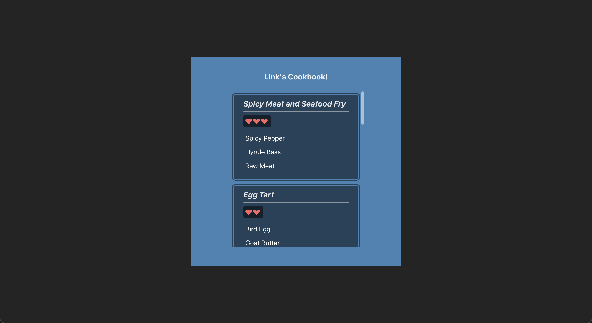

# 🥘 [Exercise 2] Link's Cookbook 🍎
- Exercise directory: `/src/exercises/2-links-cookbook/`
- Display exercise: http://localhost:5173/exercise2
- Sample answer: `/src/answers/2-links-cookbook`
- Display sample answer: http://localhost:5173/answers/exercise2

## Components and Props
Components are kind of like the functions of React! They help you chunk your code into smaller, more managable elements. Similar to how functions work, sure you could just write all your code in main, but it makes your code much more readable and reusable :)

If you've done any object oriented programming, I would say that that Components/Props are a little more analagous to Objects, where they each have their own set of variables and functions. 

Also in react, basically everything rendered is a component - you might have noticed it from the syntax of `App.jsx` but it is essentially a big component that contains many smaller components.

### Components
To **use** a component you have created:

1) import your child component at the top of your file
2) use it in your markup with the syntax `<ComponentName/>`

```javascript
import ChildComponent from './path-to/ChildComponent'
const ParentComponent = () => {
    return (
        <ChildComponent/>
    );
}
```

To **create** a component
1) create a new file for it called `ComponentName.jsx` (pascal case), usually in the `components/` directory - dw about doing it here in the exercises
2) create a new function called `ComponentName`
3) `export default ComponentName;` at the bottom of your file

```jsx
// Usually good syntax practice to use arrow functions
const ChildComponent = () => {
    return ();
}

export default ChildComponent;

// But this is also fine
function ChildComponent() {
    return();
}

export default ChildComponent;
```

### Props
Props are components that take in some **prop**ertie**s**!

```jsx
// The 'number' and 'message' fields can be named anything you want!
// You can also pass in 0 or more fields to a prop
const ParentComponent = () => {
    return (
        <ChildProp1 number={4} message={"among us"}/>
        <ChildProp2 number={4} message={"among us"}/>
    );
}

const ChildProp1 = (props) => {
    // to access the 'number' and 'message' fields being passed in, 
    // we just do props.[FIELDNAME]
    const num = props.number;
    const msg = props.message;
    console.log(num + msg);
    ...
}

// We can also destructure our prop by using curly braces
const ChildProp2 = ({number, message}) => {
    console.log(number + message);
    ...
}
```

## Task
You are given a list of recipes in `recipeData.js` that include data on a recipe's name, ingredients, and hearts restored. In `CookBook.jsx`, display each of the recipes as recipe cards to recreate the following page:



You will have to create your own components that may or may not use props.

For the heart icons, we've installed [react-icons](https://www.npmjs.com/package/react-icons) in this project, so you can just use:
```
import {BsFillSuitHeartFill} from "react-icons/bs";
```

You may need to create and import your own css file in order to style some elements to make it match the result, but once again, don't worry if your styling isn't super on point (esp during the workshop, just at least display the data).

<details>
    <summary>Hint</summary>
    You will probably want to create a reusable component <code>RecipeCard</code> that takes in a <code>recipeName</code>, and list of <code>recipeIngredients[]</code> as its props.
</details>

