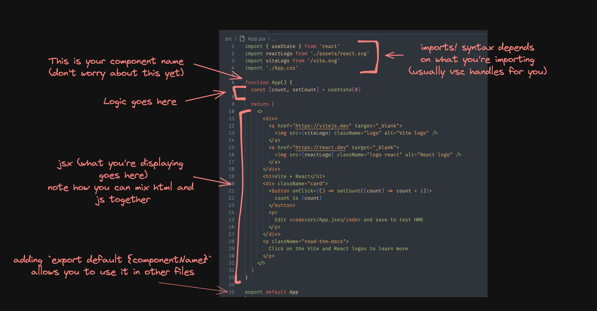

# 🌱 Introduction to React ⚛︎

---

**Authors**: Nicole Chun

## Content Summary
1) [Background and Resources](../index.md)
2) Setup and Introduction
3) [Exercise 1](./1-character-card.md) - Character Profile (Markup and JavaScript)
4) [Exercise 2](./2-links-cookbook.md) - Link's Cookbook (Components and Props)
3) [BONUS Exercise 3](./3-cooler-spotify.md) - Cooler Spotify

**Please note that the exercise solutions are contained within the exercise folder for this workshop**

## Setting up
Usually we create a react app using a **react based framework**. A framework is essentially a structure you can build your software on so you aren’t starting with an empty directory. For simplicity we will not start with one, and are instead going to use a tool called [Vite](https://vitejs.dev/).

First, create a **Fork** of this directory. Then in the terminal, `git clone` the forked repository and `cd` into it.

To run the application, first run `npm i` to install all the project dependencies, then `npm run dev`, and copy paste the link http://localhost:5173/ into your browser to view the app! Every time you make changes, the page will automatically refresh when you save so you don't need to manually reload the page every time :)

```
$ npm i
    ...
$ npm run dev

  VITE v5.0.11  ready in 833 ms

  ➜  Local:   http://localhost:5173/
  ➜  Network: use --host to expose
  ➜  press h + enter to show help
```
Note that localhost means that we are running a local server, so your site will stop working after you have terminated the connection with `^C` or `^D`.

## Directory Structure
Depending on the framework used for your project, your directory structure may look a little bit different, but will usually contain the following files or directories:

| File/dir           | Description                                                                                                                                                                       |
|--------------------|-----------------------------------------------------------------------------------------------------------------------------------------------------------------------------------|
| App.jsx            | Your project’s main hub! Usually will contain some routes to different pages.                                                                                                     |
| index.css          | Any global styling can be found here (basically css that will show up on all your pages)                                                                                          |
| types.ts           | Depending on the scope of your project, this might be a directory with a few files in it. But this contains any interfaces or types that you may need to use to pass data around. |
| assets/            | Any media you might use in your `.tsx` files!                                                                                                                                     |
| components/ props/ | Reusable chunks of code + styling that you have broken your page down into. Props are literally just components that take in ‘properties’.                                        |
| pages/             | The main pages that your ‘app’ has. Usually you would have a route in `App.tsx` to each page.                                                                                     |

Note that since Vite is not a framework, some of these files/directories are missing, but you should put your code inside the `src` directory (and optionally make subdirectories to organise your exercises).

## File anatomy
Open `src/App.jsx`, you should be greeted by some pre-written code; don't worry about what it does yet, but this can give you a general idea of how a **component** is laid out.



In React, you'll mainly be working with `.jsx` files, this stands for **J**ava**S**cript **X**ML. Basically, it allows you to combine markup and javascript together, rather than putting them in seperate files. We will go further into this later :)


