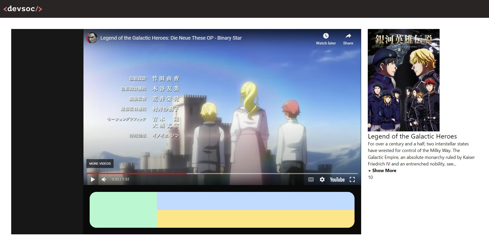

# DevWatch 📺
**Focus**: TailwindCSS, React

**Authors**: Dylan Huynh

Dylan frequently uses the website shown below to **"legitmately" stream anime**. Fearing a possible **permanent service disruption** in the near future he commissioned Kevin, another Software Engineer to recreate the website. However, Kevin has mysteriously disappeared, as such Dylan has tasked you to finish recreating the website.  


# Setup
Inside the reputable-anime-site directory
```sh
$ npm install
$ npm run dev
```

# Part A - Setting up the layout
Let's start by setting up the layout. In App.jsx let's define a layout using flexbox where the VideoController takes up the majority of the screen with the information column will take up the rest of the horizontal space. Finally add the Navbar component to the top of the page.

Inside the video controller define sections for the episode controllers
- Sidebar for selecting episodes
- A section for selecting streaming sources
    - Subdivide this section in 3 parts as per the original website design shown above

For fill each section with a different background colour. We're looking to see if the layout is correct and will work on a variety of desktop screen sizes. To test this try resizing your browser window. 


At this stage your webpage should look similar to the image below.


If you are so inclined you could also make the layout work for mobile by making the info panel (pink) either disappear on smaller screens or move below the video player.  [Breakpoints](https://tailwindcss.com/docs/responsive-design) will be helpful.

# Part B - Complete the Info Panel

Kevin already finished most of the **info panel**. His work can be found in **components/SeriesInfo.jsx**.

Your task is to insert the SeriesInfo component into the main page and finish the following functionality

- Display the title and description
- The description should be limited to 200 characters until the user presses +show more. Will revert back when -show less is pressed. The show text should be placed after the description.
- Score card (optional), see design in the original website

<details>
  <summary>Click for Title, Description and Score</summary>
  
    Title: Legend of the Galactic Heroes
    Score: 9.8
    Description: For over a century and a half, two interstellar states have wrested for control of the Milky Way. The Galactic Empire, an absolute monarchy ruled by Kaiser Friedrich IV and an entrenched nobility, seeks to suppress the rebels daring to oppose the inviolable crown. The Free Planets Alliance, a representative democracy led by a corrupt High Council, degenerates as its elected leaders⁠ use war and conflict as a way to win popular support. But this long-standing stalemate between the Empire and the Alliance ends with the rise of two opposing military geniuses. Reinhard von Lohengramm, a minor noble and High Admiral of the Empire through his strategic brilliance and his sister's position as the favored concubine of the Kaiser, dreams of conquering the galaxy and uniting mankind under his iron fist. Meanwhile, Yang Wen-li of the Alliance, an avid historian and reluctant commodore hailed as the Hero of El Facil, uses his tactical prowess to navigate around his leaders' incompetence—and to carve the path to lasting peace. As the war rages on, Reinhard and Yang each strive for their ideals and to secure their place among the stars as the leaders of a new era of galactic heroes. [Written by MAL Rewrite] 
</details>





# Part C - Adding Episode Controls 

Before his disappearance Kevin was also working on VideoController.jsx, which will contain the video player itself and all the controls required to change episodes and streaming services. Unfortunetly he was unable to complete the controls.

Your task is to complete the following UI components

### Episode Sidebar
- Display all the episodes on the side of the VideoPlayer
- Number all episodes
- Alternate colours between episodes
- When an episode is clicked on the left it will change the videosrc for the video player.
- The selected episode will have a marker to indicate it has been selected. Make sure to align this correctly!

### Streaming Service Controls
- Display all subs and dubs streaming services. These have been hardcoded in VideoController.jsx
- Display the correct episode name and streaming source
- The appropiate icons have already been imported from React Icons. It may be easier to style these icons through using the React Icons API instead of Tailwind classes
- Display a dotted line between the sub and dub sections

Your app should now look similar to the image below


# Part D - Background Blur (Optional)

Finally we're going to add some finishing touches, by adding the background blur effect. Let's make Kevin proud!


As far as I'm aware there is no easy way of doing this through tailwind, so we're going back to regular CSS.

Inside **index.css** add styles that will help achieve the blurred background effect. Do not edit the index.html file and instead make all of your changes inside **App.tsx**.

The background image is provided in the public folder, you will be able to achieve this effect with purely css filters.
