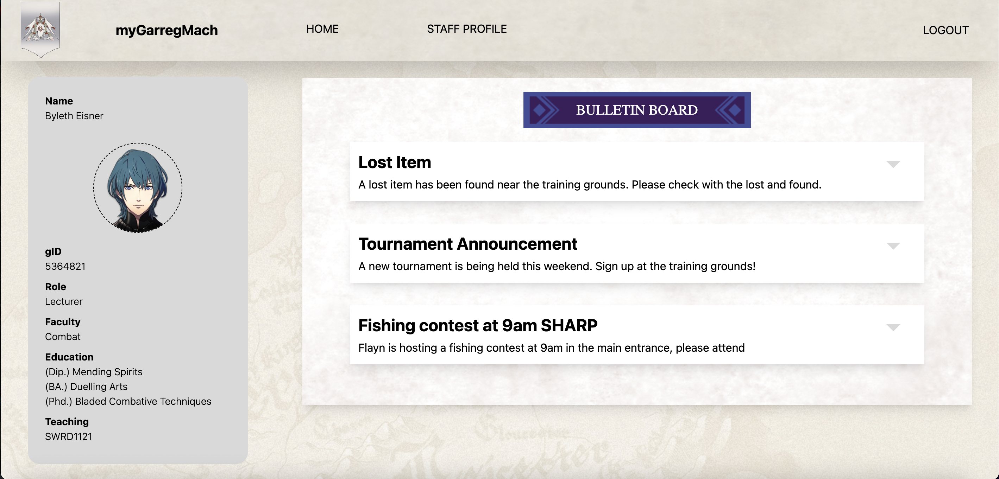
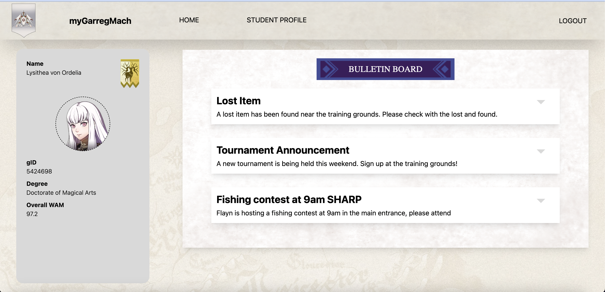

# myGarregMach

**Focus:** localStorage, databases 

**Authors:** Jayden Nguyen

ATTENTION! 

The Church of Seiros is upgrading their existing medieval pen-and-paper student enrolment system to a new-and-improved online system for Garreg Mach Monastery. Unfortunately, the recent invasion of the *Death Knight* has scared off all the software engineers ~~(cowards)~~, leaving the conversion incomplete.


In response, Professor Byleth, (a man of *too* many talents), has been comissioned by the Church to finish off the work left over by the previous engineers. Lucky for him, the frontend and *most* of the backend has already been completed.
## Startup

To begin, first verify that both the frontend and backend work.

In your editor, initialise TWO terminal screens. 

On one screen, run
```bash
cd client
npm install 
npm run dev
```

Navigate to the localhost link, and you should be greeted by the "Welcome Back!" Login page.

On the other screen, run 
```bash
# you should have already installed the server node_modules when setting up already.
cd server
npm run start
```

If you need assistance, please ask one of the Leads or Directors for assistance!

## Exercise 1 — Basic Local Storage

Your first task is to complete the login functionality. The frontend needs to store a user's `gID` and `USER_TYPE` inside `localStorage`.

Navigate over to `client/src/pages/Login.tsx`. In the `handleSubmit` function, there is a zone for you to finish off the existing code with guidance comments left by the previous engineers.

To login, you can use Professor Byleth's credentials:

```
gID: 5364821
password: pokerfaceprof
```

If you've done it correctly, the Login page should redirect you to the Home Page!

## Exercise 2 — Simple localStorage Clear

Currently, the Logout button is incomplete - clicking it doesn't seem to do anything :/

Navigate over to `client/src/components/Navbar/Navbar.tsx`. Your next task is to clear *all*  of `localStorage` to ensure a Logout redirects back to the Login page. 

If your solution is correct, clicking Logout should redirect you back to the Home page.

## Exercise 3 — A Basic Batabase Lookup 

Hmm...the notice board is looking a bit empty - let's fix that!

For context, myGarregMach currently makes use of Firebase's Firestore to handle its database storage. Firestore is organised by two primary dataStorage types: collections and documents. 

A Collection is a group of Documents. Documents are how we store one instance of data, and Collections is like a folder that wraps them up. To give a concrete example, in our case, a single Notice would be a Document, whereas all notices in the database would be stored under the 'notices' collection.

Like a computer, to find a specific file (or a set of files), you first have to access the folders (or Collections), before you can access the Documents. This can be done on Firestore by using 

```js
await getDocs(collection(databaseRef, collectionName)). 
```

Lucky for you, the `databaseRef` can be obtained using `getDb()`, a helper function written by the previous engineers located in `server/src/utils/db.ts`!

After calling `getDocs()`, it will return a `QuerySnapshot`, which is like a "tray" containing all the data from the Collection. A specific reference as to what `QuerySnapshot` is can be found on the [official docs](https://firebase.google.com/docs/reference/js/firestore_.querysnapshot.md#querysnapshot_class). You can access individual Documents by using `forEach((doc) => {...})`, and can obtain the actual data they contain using `doc.data()`.


With all that info in mind, head over to `server/src/funcs/notices.ts`. You will notice (haha, get it?) that the function is a stub. Don't worry if you are unfamiliar with the code setup for now, there's a bunch of comments that will guide you on how to complete this function :)

Your task is to complete the stub, such that it will return an Object, with a field 'notices', which contains an array of `Notice`s. 

To get an idea of what a single `Notice` might look like, take a look over at `server/db/dbData.json`. But a quick reference is also found here:

```
{
    title: string,
    body: string
}
```
You won't have to restart the backend each time you save (it automatically does it). But you will need to refresh your web page each time you make a change on the backend.

If you are successful, the notices should appear!



## Exercise 4 — Pre-processing retrieved database data

It looks like we've gotten the notices to be fully functional! 

However, if you navigate over to the Staff Profile page, and select View Students - you'll see there are no students! :(

Your task for this exericse is to complete the function in `src/server/funcs/studentCards.ts`. 

Exercise 4 is just Exercise 3 but with a little bit of extra steps - so you can use similar code, or, you can look at similar funcs that have already been implemented.

You will probably need to login and logout over again to verify that your changes work (yes, I know it's annoying but I'm trying to save you from using your limited database READs). Lucky, nodemon makes it less annoying for backend modification.

If your code is correct, the sample screen should appear:


## Exercise 5 — Retrieving data with a specific query

Now it seems we have something working on the Staff page - but the Student page needs a bit of working too!

Log out of Professor Byleth's account, and try logging into a student's account (don't worry, as a Professor, you are *meant* to have access to this private info 💀). 

You can find a student to login by choosing your favourite from `server/db/dbData.json`. Or you can use the credentials of a student I've chosen for you :)

```
gID: 5424698
password: studiousmage
```

We've talked before about how to get all documents out of a collection, but how can we *query* for a single document based on some criteria? Luckily, Firestore offers just that!

Using the `query()` function, we can effectively compose a single query with multiple conditions.

An example piece of code to get the associated `QuerySnapshot` might be:

```js
await getDocs(query(collection(databaseRef, collectionName), where(documentField, condition, value)));
```

In this piece of code, the `where` is akin to an SQL statement WHERE. So for example, if I want to find a staff member that has `gID` of `'5364821'`, this is represented in SQL as, `SELECT * FROM staff WHERE gID = '5364821'`. We can modify this to Firestore's modules with this:

```js
where(gID, '==', '5364821')
```

Using this information, your task is to go to `server/src/funcs/studentDetails.ts` and complete the stub. There is already existing information (and code from other functions) that might provide you a clue as to how to implement this! 

Again, you will likely need to login and logout of the account to check if your server changes are indeed valid. If they are, the following screen should display (assuming you've used the login I chose for you):



