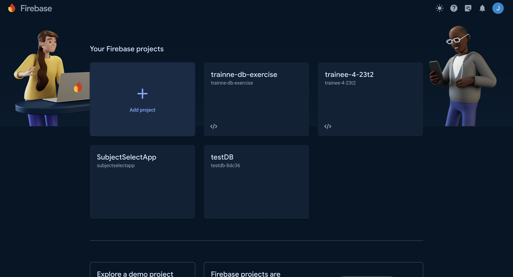
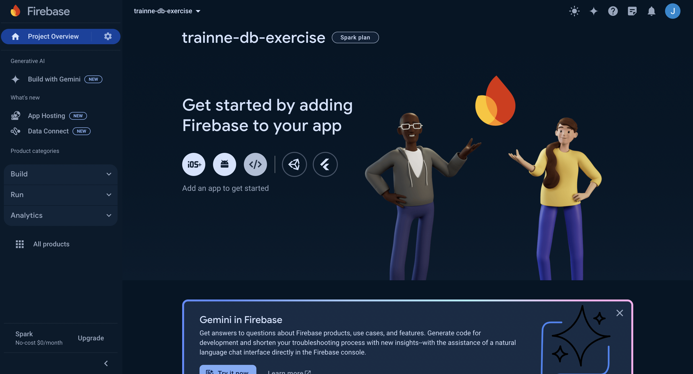
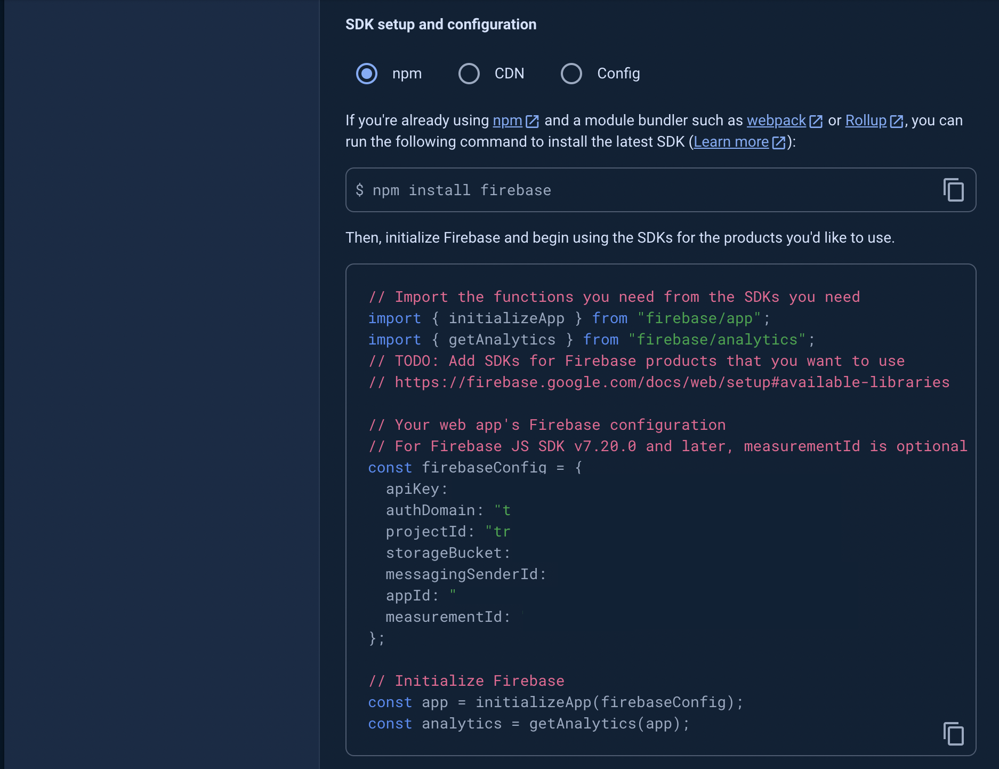
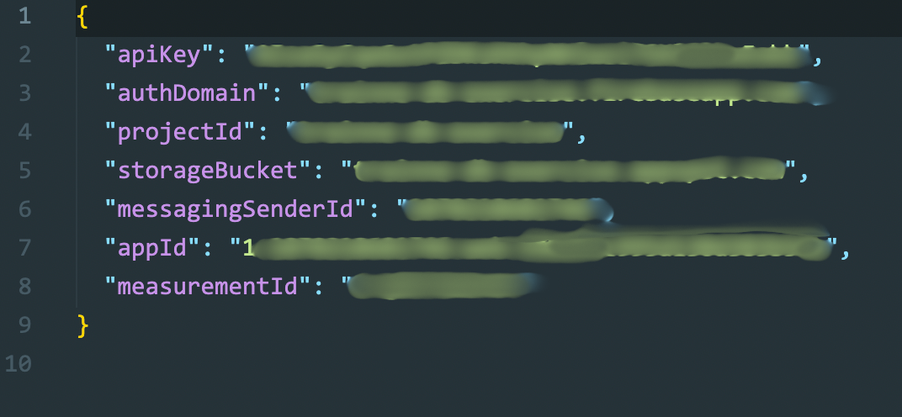
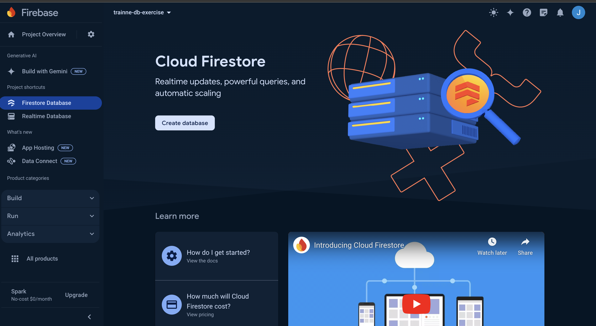
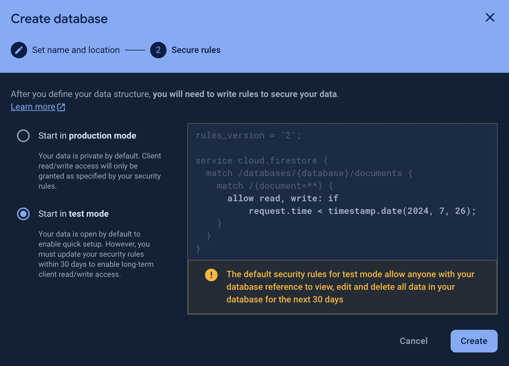
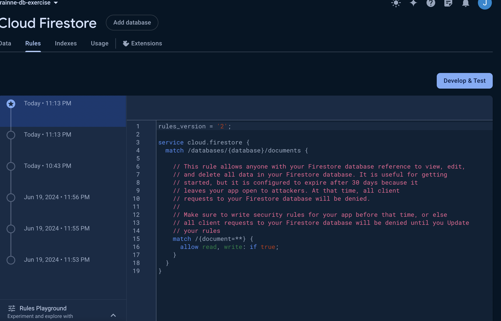
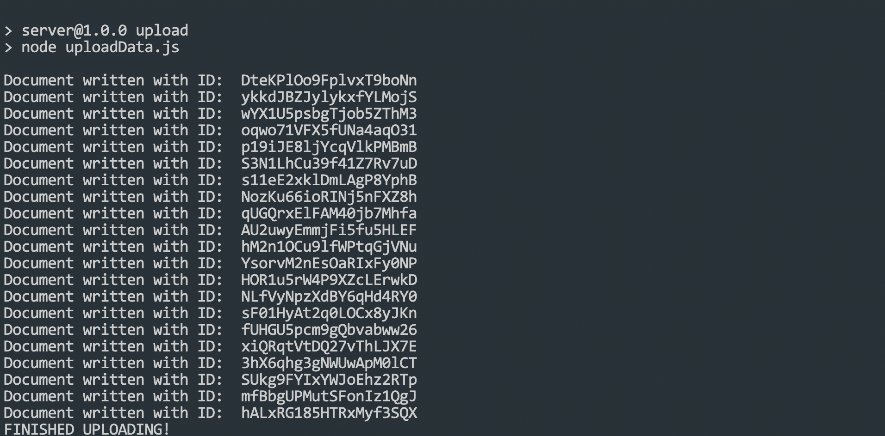
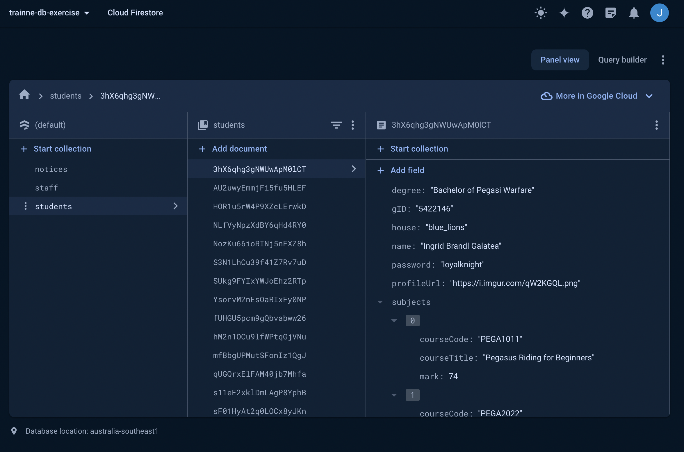

# 6.1 - Setting Up the Database

**Authors**: Jayden Nguyen

For this exercise, there is a bit of setup required. It is recommended that you do this prior to the workshop as to save time on working the exercises!

This workshop exercise will make use of Firebase's Firestore as the database. Your trainee projects might make use of MongoDB or other alternatives, so whilst it may not exactly be the same, the skills are very much transferrable! :)

## 1. Sign into Firebase Console

Our first step will involve creating a new account for Firebase. Head over to https://console.firebase.google.com/, and if prompted to sign in, please do so!

## 2. Create A New Project

Head over to the Console, and create a new Project. If you are prompted for Google Analytics, it is optional — however, should you choose to do it, just select Default App on the screen after for your configuration.



## 3. Create a New Web App 

Now, you'll be greeted with a home screen that looks like the following:



**Click the `</>` looking icon to create a Web App!** 
This will be used for our configurations. Give it any name (preferably myGarregMach but it doesn't really matter). 

After creating your app, your screen should give you something that looks like this (I blurred out the credentials on my screen):



**Keep this details opened, they will be important for the next step.**

## 4. Loading Credentials 

In your code editor, open the `exercises/myGarregMach` folder, and navigate to the `server` folder. Create a new file in this folder called `fireBaseConfig.json`. **It is important the file is named exactly as described.** (It should be at root level, not inside `src`).

Now, from the previous step, click the `Config` radio button, and copy and paste the object into `fireBaseConfig.json`. 

That's half the work! Now, get rid of the `const firebaseConfig =` and the semicolon at the end. Then, add double quotation marks around each of the fields on the left. 

The final result should look like this (minus the blur marks):



## 5. Setting up the Firestore

Go back to the Firebase Console, and under the sidebar, under "Build", click the Firestore Database option. 



Then click the big 'Create database' button!

Set the location to `australia-southeast (Sydney)`. (Unless you're on the other side of the world).

Afterwards, select "Start in test mode". 



## 6. Database rules

Your database should now be created! Now we just need to modify the database rules to ensure we can work with the data involved!

Head over to the 'Rules' tab of the firestore, and replace the `request.time < timestamp.date(...) ` with `true`. The final result should look like this:



Publish the changes. 

## 7. Uploading the Data

For this exercise, I've already created data and a script to upload! All you need to do is to upload them. :) 

`cd` into the `server` folder under `myGarregMach`. 

Then, run
```
npm install
```

Once the download has completed, run 
```
npm run upload
```

If you've done everything correctly, your console should look like this:



If the upload was successful, you can look over to the database and see the following:



...And that's it! The Set Up phase is completed!! Now onto the exercises :)


