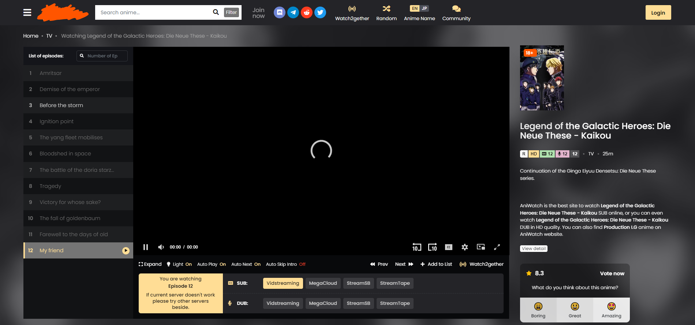
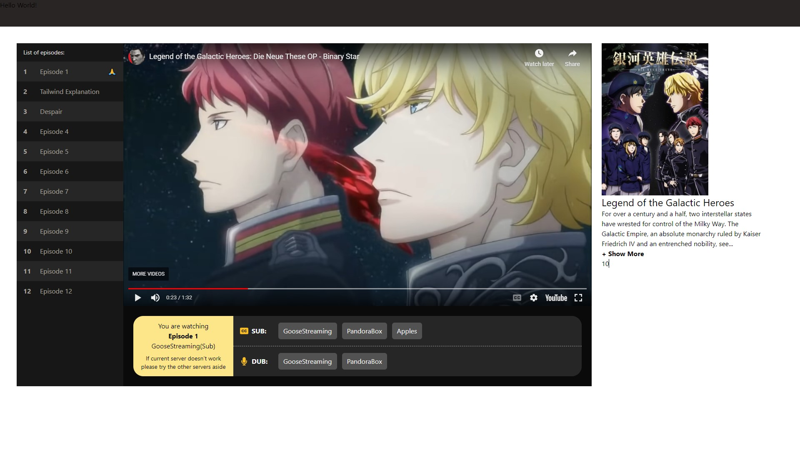

# DevWatch 📺
**Focus**: TailwindCSS, React

**Authors**: Dylan Huynh

Dylan frequently uses the website shown below to **"legitmately" stream anime**. Fearing a possible **permanent service disruption** in the near future he commissioned Kevin, another Software Engineer to recreate the website. However Kevin has mysteriously disappeared, so Dylan has tasked you to finish recreating the website.  



# Setup
Inside the reputable-anime-site directory
```sh
$ npm install
$ npm run dev
```

# Part A - Setting up the layout
Let's start by setting up the layout. In App.jsx let's define a layout using flexbox where the VideoPlayer takes up the majority of the screen with the information column will take up the rest of the horizontal space. Finally add a Navbar to the top of the screen.

For fill each section with a different background colour. We're looking to see if the layout is correct and will work on a variety of desktop screen sizes. To test this try resizing your window. 

At this stage your webpage should look similar to the image below 


If you wish

# Part B - Adding Episode Controls 

The VideoController conatins the entire player that




# Part C - Complete the Navbar (Optional


# Part D - Background Blur (Optional)
