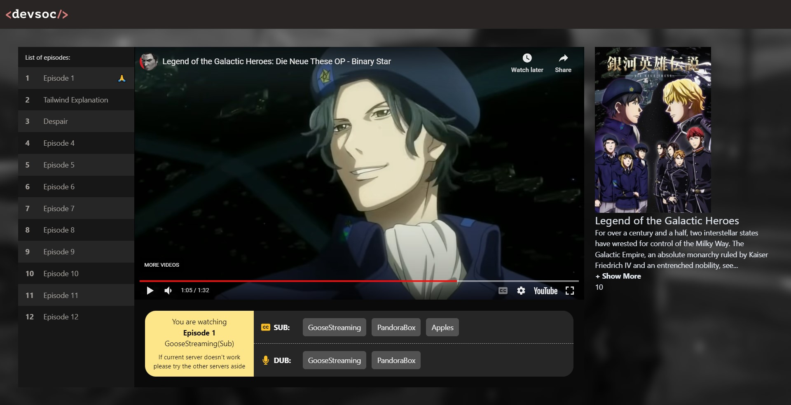

# DevWatch 📺
**Focus**: TailwindCSS, React

**Authors**: Dylan Huynh

Dylan frequently uses the website shown below to **"legitmately" stream anime**. Fearing a possible **permanent service disruption** in the near future he commissioned Kevin, another Software Engineer to recreate the website. However, last week Kevin mysteriously disappeared o7, so Dylan has tasked you to finish recreating the website.  


# Setup
Inside the reputable-anime-site directory
```sh
$ npm install
$ npm run dev
```

# Part A - Setting up the layout
Let's start by setting up the layout. In App.jsx let's define a layout using flexbox where the VideoPlayer takes up the majority of the screen with the information column will take up the rest of the horizontal space. Finally add a Navbar to the top of the screen.

For fill each section with a different background colour. We're looking to see if the layout is correct and will work on a variety of desktop screen sizes. To test this try resizing your window. 


At this stage your webpage should look similar to the image below 


If you are so inclined you could also make the layout work for mobile by making the info panel (pink) either disappear on smaller screens or move below the video player. Investigate [breakpoints](https://tailwindcss.com/docs/responsive-design) 

# Part B - Adding Episode Controls 

The VideoController conatins the entire player that


# Part C - Complete the Info Panel

Kevin already finished most of the **info panel**. His work can be found in **components/SeriesInfo.jsx**.

Your task is to insert the SeriesInfo into the page intot he appropiate section


# Part D - Background Blur (Optional)

Finally we're going to add the background blur effect



As far as I'm aware there is no easy way of doing this through tailwind, so we're going back to regular CSS.

Inside **index.css** add styles that will help achieve the blurred background effect. Do not edit the index.html file and instead make all of your changes inside **App.tsx**.

The background image is provided in the public folder, you will be able to achieve this effect with purely css filters.
